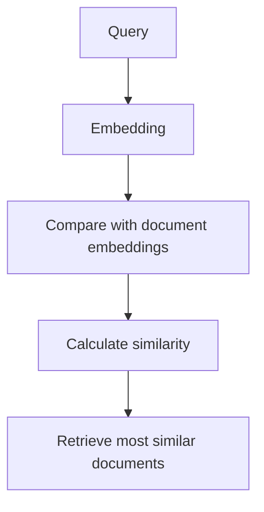
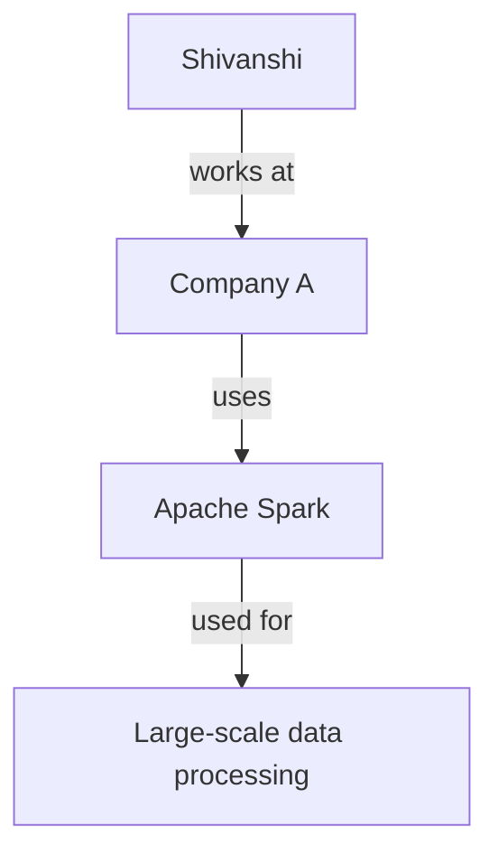
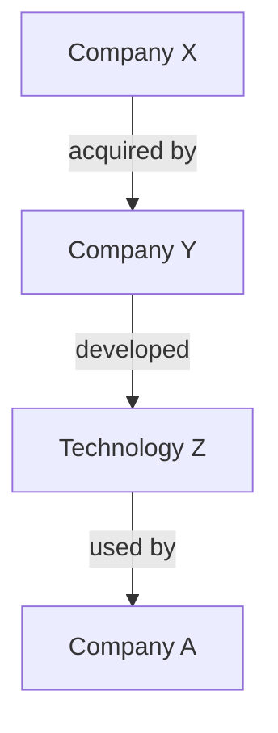
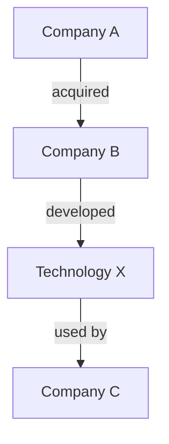
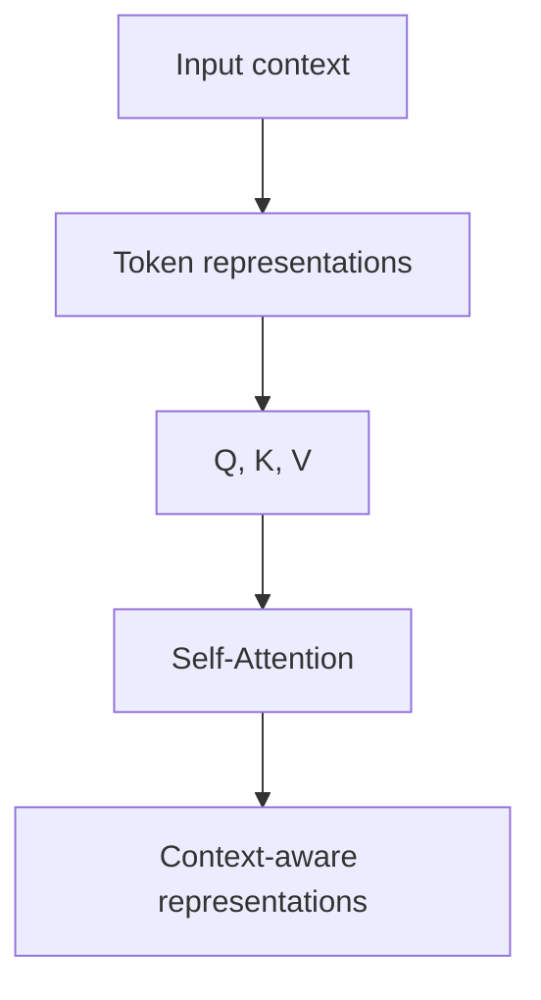
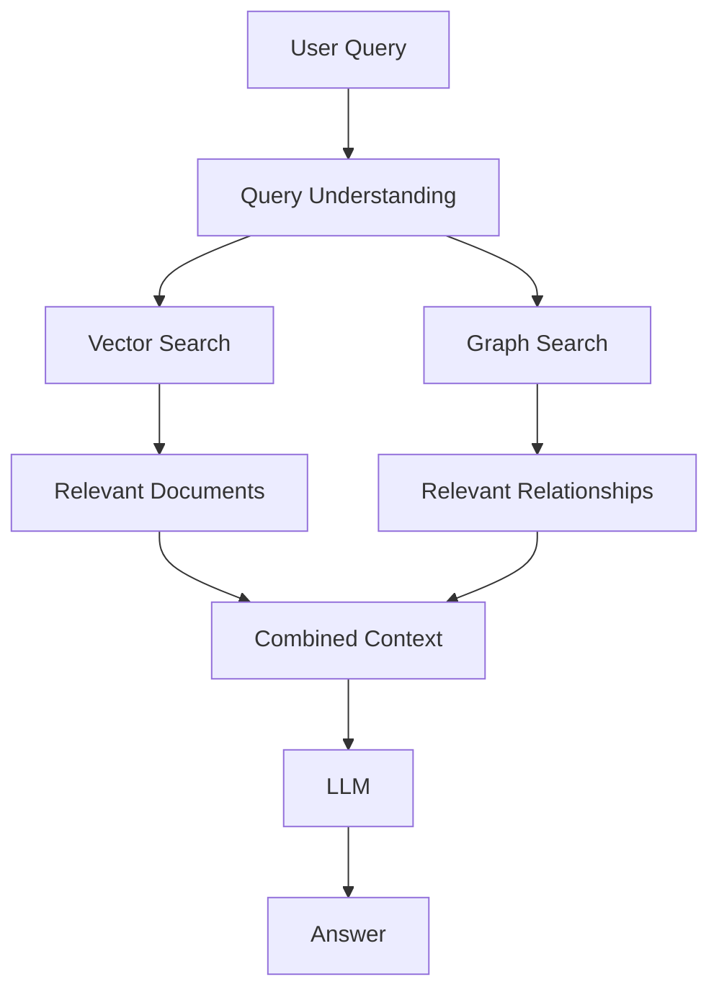
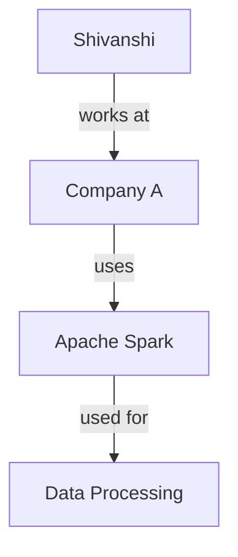

# Similarity Search vs GraphRAG

## 1. Similarity Search — My Understanding

Similarity search is commonly used in LLM applications to find information that is semantically similar to a user's query.

The basic idea is that the text is converted into an embedding vector. The query is also converted into an embedding vector. The system then compares the query vector with the vectors stored in the database.

For example, suppose the database contains:
- **Document 1** → *How to use Python loops*
- **Document 2** → *Introduction to Apache Spark*
- **Document 3** → *Basics of Large Language Models*

If the user asks:
> *"How do I write a for loop in Python?"*

The query is converted into an embedding and compared with the stored document embeddings. The system may find:



A commonly used similarity measure is **cosine similarity**. 
The basic formula is:
```
cosine similarity = (A · B) / (||A|| ||B||)
```
*where **A** is the query embedding and **B** is a document embedding.*

A higher similarity score generally means that the two vectors point in a more similar direction. The important thing I understood is that similarity search is mainly looking at **semantic closeness** between representations.

For example:
- Python loops document → **High similarity**
- Python functions document → **High similarity**
- Quantum physics document → **Low similarity**

This is useful because the system does not need the query and document to contain exactly the same words. It can retrieve text that has a similar meaning.

### Connection with Transformers
The embeddings used for similarity search are generally produced by neural network models based on Transformer architectures. Transformers use mechanisms such as **self-attention** to create contextual representations of tokens.

Self-attention allows a token to use information from other tokens when creating its representation. For example:
> *The cat is sitting on the mat.*

The representation of *cat* is not created completely independently. The model can use the surrounding context when producing its representation. The final embedding therefore captures semantic information about the text. This is why similarity search can find documents that are conceptually related even when they do not use exactly the same words.

### What I understood
The main thing I understood is that similarity search converts text into vectors and retrieves information based on how similar those vectors are. It is very useful for semantic search and RAG systems, but similarity is not the same as understanding the complete relationships between different pieces of information. This is where I started looking into the limitations of similarity search and how GraphRAG can help augment it.

---

## 2. Limitations of Similarity Search

Similarity search is useful for finding information that is semantically close to a query, but it has some limitations. The main limitation I understood is that **similarity does not always represent the relationship between different pieces of information.**

For example, suppose we have these facts:
- Shivanshi works at Company A.
- Company A uses Apache Spark.
- Apache Spark is used for large-scale data processing.

Now suppose the user asks:
> *"What technology does Shivanshi's company use for large-scale data processing?"*

A similarity search system may retrieve the first or second statement because they contain information related to the query. But answering the question properly requires connecting multiple pieces of information:



The important part here is the relationship between the entities, not just the similarity of the individual text chunks.

### 2.1 Similarity does not explicitly represent relationships
In vector search, information is usually represented as vectors. For example:
- **Document A** → `[0.21, 0.45, 0.72, ...]`
- **Document B** → `[0.19, 0.48, 0.70, ...]`
- **Document C** → `[0.80, 0.12, 0.31, ...]`

The system can determine that A and B are similar. But the vector itself does not explicitly say:
`A → related to → B`
or:
`Person → works at → Company`
`Company → uses → Technology`

Those relationships have to be inferred from the text.

### 2.2 Multi-hop questions can be difficult
Similarity search can also have difficulty with questions that require information from multiple steps. For example:
> *"Who is using the technology developed by the company that acquired Company X?"*

To answer this, the system may need to follow several relationships:

The answer depends on following this chain rather than simply finding the most similar piece of text.

### 2.3 Chunking can separate related information
RAG systems normally divide documents into smaller chunks before creating embeddings. For example:
- **Chunk 1**: Company A acquired Company B.
- **Chunk 2**: Company B developed Technology X.
- **Chunk 3**: Technology X is used in healthcare.

If these chunks are stored independently, their direct relationships may not be explicitly represented. A similarity search might retrieve Chunk 3 because it is very similar to the user's question, while missing Chunk 1 and Chunk 2 that are necessary to understand the complete chain.

### What I understood
The main thing I understood is that similarity search is very good at finding semantically related information, but it **does not naturally represent explicit relationships between entities**. It can answer many direct questions very well, but questions involving multiple entities, relationships, and multiple steps can become more difficult. This is one of the reasons I started looking at GraphRAG, where the information can be represented as a graph and the relationships between entities can be used during retrieval.

---

## 3. Similarity Search and Self-Attention

The limitation of similarity search becomes easier for me to understand when I connect it with how Transformers work. A Transformer uses self-attention to understand the relationship between tokens within the input sequence.

For example:
> *The cat drank milk.*

When processing the sentence, the attention mechanism calculates relationships between the different tokens. Conceptually:
`The → cat` | `cat → drank` | `drank → milk`

The Query and Key vectors are compared using the dot product (`QKᵀ`). This produces attention scores that determine how much one token should pay attention to another token. So self-attention is very good at finding relationships between tokens **within the context being processed**.

However, this is different from having an explicit graph of relationships across a large collection of documents. For example, suppose the information is spread across different documents:
- **Document 1**: Company A acquired Company B.
- **Document 2**: Company B developed Technology X.
- **Document 3**: Technology X is used by Company C.

The Transformer can understand these relationships when the relevant information is provided in its context. But the information itself is not stored as an explicit structure like:


This distinction is important for RAG systems.

### Self-Attention works within the provided context
My understanding is that self-attention determines which tokens are important to each other within the sequence that the model is currently processing.



If the required information is not retrieved into the context, the model cannot use self-attention to directly attend to that missing information. This means that the quality of retrieval is very important in a RAG system.

### What I understood
The main thing I understood is that **self-attention helps the Transformer understand relationships between tokens within the context provided to it**, while **similarity search is used to retrieve relevant information from a larger collection of data**. Self-attention does not create a persistent knowledge graph of entities and relationships across the entire document collection. This is where GraphRAG can be useful, because it can add structured relationships to the retrieval process.

---

## 4. Why GraphRAG Can Help

GraphRAG is a way of improving a normal RAG system by adding a graph structure to the information being retrieved. The main idea I understood is that instead of only storing documents as chunks and searching for similar chunks, we can also identify the important entities and relationships inside those documents.

For example, suppose we have:
- Company A acquired Company B.
- Company B developed Technology X.
- Technology X is used by Company C.

A normal vector-based RAG system may store these as separate chunks, often using embeddings. With GraphRAG, we can represent the information as a graph:


Here:
* `Company A`, `Company B`, `Technology X`, and `Company C` are **nodes**.
* `acquired`, `developed`, and `used by` are **relationships** between the nodes.

This gives the system more structured information about how the different entities are connected.

### How GraphRAG works with normal RAG
I understood that GraphRAG does not necessarily mean completely replacing vector search. We can use both approaches together.

A simplified flow can be:


Vector search can help find information that is semantically similar to the query. Graph search can help find connected entities and relationships that may be important for answering the query.

For example, if the question is:
> *"Which technology is used by the company acquired by Company A?"*

Vector search can find relevant documents about Company A, acquisitions and technologies. The graph can then help follow the relationship:
`Company A → acquired → Company B → uses → Technology X`

This makes the multi-step relationship easier to retrieve.

### What I understood
The main thing I understood is that **GraphRAG augments normal RAG by adding relationships between entities and pieces of information.**
- **Vector search answers:** *What information is similar or relevant to my query?*
- **Graph retrieval answers:** *How are the relevant pieces of information connected?*

So I see GraphRAG as a way to make retrieval more useful for relationship-heavy and multi-hop questions, while vector search remains useful for finding semantically relevant information.

---

## 5. GraphRAG — Basic Working

My understanding is that GraphRAG adds a graph layer to a normal RAG system. In normal RAG, documents are usually divided into chunks and converted into embeddings. These embeddings are stored in a vector database so that similar information can be retrieved later.

In GraphRAG, we additionally extract entities and relationships from the information and represent them as a graph.

### Vector Search and Graph Search have different roles
I understand them as complementary rather than competing approaches.

**Vector search:**
`Query → Embedding → Similarity → Relevant text`
It is useful when I want to find text that has a similar meaning to the query.

**Graph search:**
`Query → Find relevant entities → Follow relationships → Find connected information`
It is useful when the answer depends on relationships between entities.

### What I understood
The main thing I understood is that GraphRAG adds structure to information that would otherwise mainly be represented as independent document chunks. Normal RAG is very useful for semantic retrieval, but when a question requires following relationships across multiple pieces of information, a graph can provide an additional way to retrieve the required context. So GraphRAG can be thought of as augmenting vector-based retrieval with explicit relationships between entities and information.

---

## 6. Knowledge Graph — My Understanding

A knowledge graph is a way of representing information using entities and relationships. 
The main components are:
- **Node** → Entity
- **Edge** → Relationship

For example:

Instead of storing only text, the knowledge graph represents these connections explicitly.

### Why this is useful for GraphRAG
The main advantage of a knowledge graph is that it makes relationships between entities explicit. This is useful when information is distributed across multiple documents or chunks and the answer requires following relationships between entities. 

### What I understood
The main thing I understood is that a knowledge graph represents information as nodes and relationships, providing an explicit structure that vector similarity alone does not provide.

---

## 7. NetworkX — My Understanding

NetworkX is a Python library used to create, manipulate, and analyze graphs. I looked at NetworkX because it provides a simple way to represent entities and relationships programmatically, which is useful for understanding and prototyping graph-based systems.

A simple directed graph can be created using:
```python
import networkx as nx

graph = nx.DiGraph()

graph.add_node("Shivanshi")
graph.add_node("Company A")
graph.add_node("Apache Spark")

graph.add_edge("Shivanshi", "Company A", relation="works at")
graph.add_edge("Company A", "Apache Spark", relation="uses")

print(graph.nodes())
print(graph.edges())
```

`nx.DiGraph()` creates a directed graph, which is useful when relationships have a direction.

### Finding connections
NetworkX can also be used to explore relationships between nodes.
```python
print(list(graph.successors("Shivanshi")))
```
This returns the nodes that Shivanshi has outgoing connections to.

NetworkX can also find paths between nodes:
```python
path = nx.shortest_path(
    graph,
    "Shivanshi",
    "Apache Spark"
)
print(path)
```
This gives the path: `Shivanshi → Company A → Apache Spark`. This demonstrates the basic idea of traversing relationships in a graph, which is relevant to graph-based retrieval.

### What I understood from NetworkX
The main thing I understood is that NetworkX allows me to create a graph, represent relationships as edges, and explore connections or paths between entities. 
**NetworkX → Create Graph → Add Nodes/Edges → Traverse/Analyze Relationships**

---

## 8. GraphRAG + NetworkX — My Understanding

GraphRAG can use a graph structure to improve retrieval when the answer depends on relationships between entities or multiple connected pieces of information. NetworkX can be used to prototype and explore this graph structure in Python.

Vector search can still be used alongside this process to retrieve semantically relevant text, while graph traversal provides structural and relationship-based context.

### Role of NetworkX
NetworkX provides operations for creating graphs and exploring relationships, such as finding connected nodes and paths. However, NetworkX itself is not GraphRAG. It is a Python graph-processing library that can be useful for learning and prototyping the graph component of a GraphRAG system.

### What I understood
GraphRAG uses graph relationships to augment retrieval, while NetworkX provides Python tools that can be used to build and explore those graph relationships. Vector search helps identify semantically relevant information, while graph traversal can help identify connected information and multi-hop relationships.

---

## 9. Final Understanding — Similarity Search vs GraphRAG

From what I understood, similarity search and GraphRAG solve different parts of the retrieval problem.

### Key Difference
- **Similarity Search** → Finds semantically similar information using embeddings.
- **Knowledge Graph** → Represents entities and their relationships explicitly.
- **GraphRAG** → Uses graph-structured relationships to augment the retrieval process, particularly for relationship-heavy and multi-hop questions.

### Self-Attention and Positional Encoding
This connects back to how Transformer-based LLMs process information.
- **Self-Attention** → Allows tokens to attend to other tokens within the provided context.
- **Positional Encoding / RoPE** → Provides information about token positions and positional relationships.

These mechanisms operate on the model's internal token representations. They do not create a persistent knowledge graph of entities and real-world relationships. Therefore, GraphRAG does not replace self-attention or positional encoding. Instead, it can augment the retrieval stage by providing structured relationship information to the LLM.

### Quick Revision
* **Self-Attention** → Token-to-token interaction within context.
* **RoPE** → Positional information for attention.
* **Similarity Search** → Semantic similarity.
* **Knowledge Graph** → Explicit entities + relationships.
* **GraphRAG** → Graph-enhanced retrieval.
* **NetworkX** → Python graph creation and analysis library.
